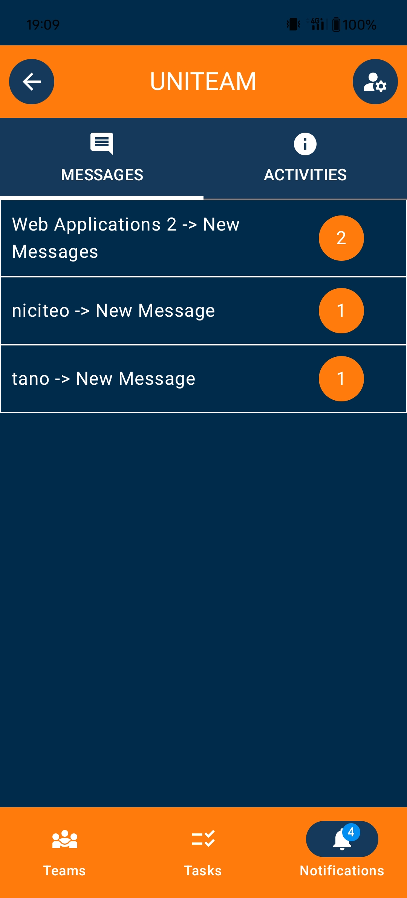
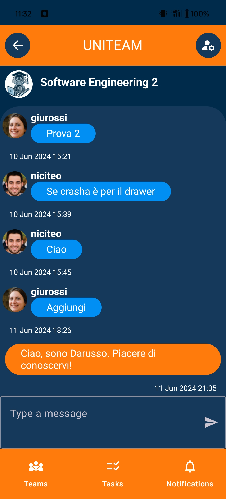

# UniTeam Screens

## LoginPage

    
    <h3>A simple and intuitive Login Page. It allows the user to login into the app with his google account.</h3>

## TeamListPage

    
    <h3>This screen can be reached using the leftmost button in the bottom bar named "Teams". It shows the list of teams the user is enrolled in. In the screen the user can find a search bar and a list of filter to find faster the team he wants to look at. In the right top most part of the screen a button for navigating to the user profile settings and in the right bottom a fab to create a new team.</h3>

## TeamTasksPage

    
    <h3>In this screen the user can find all the relevant tasks of the team, the members assigned to them, the status and others information. A useful search bar and filters to find faster whatever he is looking at. In the top-right corner a button to create a new task and in the bottom-right of the screen a floating button to enter the team chat and the one to one chat with each team members.</h3>

## TaskCreation

    
    <h3>In this screen the user has the possibility to create a new task, by specifying all its properties.</h3>

## TaskDetailsPage

    
    <h3>The description of the task with the list of all the relevant information (name, category, priority, status ecc.) In the top-right part of the screen are present two buttons to edit or delete the task.</h3>

    <h3>Scrolling down in the screen the user can find the comment-history-files section of the task. Here the user can view and add comments to the task, view the task history and upload or download the files relative to the task.</h3>
    

        
        
        
    

## TaskEditPage

    
    <h3>In this screen the user has the possibility to edit the infos related to the tasks, as well as all the related properties.</h3>

## TaskScheduler

    
    <h3>In this screen the user can have a look to all the scheduled work and schedule his task during the time. The user can find all his uncompleted tasks in the bottom of the screen and can move it in order to schedule some work to do, assigning also the estimated time he is going to work.</h3>

## Notifications

    

        
        
        <h3>In this screen the user can have a quick look to the messages received, as well as the history related to his app usage (team creation, member insertion/expulsion, as well as team deletion).</h3>
    

## UserCalendar

    
    <h3>In this screen the user can quickly look at all the task of all the teams he needs to work in the following days. All his schedule is summarized here.</h3>

## OtherUserProfile

    
    <h3>In this screen the user can find all the relevant details regarding other users including the team they have in common.</h3>

## TeamChat

    
    <h3>This is the screen dedicated to the team chat, where the members can communicate broadcastly between each others.</h3>

## TeamAndOneToOneChat

    
    <h3>In this page the user can choose if he wants to enter in the team chat or in the one to one chat with another team member.</h3>

## OneToOneMessages

    
    <h3>In this page the user has the possibility to chat directly with a specific member of his team.</h3>

## UserProfile

    
    <h3>In this screen the user can see and modify his own personal details and can also logout from the app.</h3>

## Team creation

    
    <h3>The page where the user can create a new team and setup his participation details.</h3>

## Team Edit

    
    <h3>The page where the team admin can edit an existing team (edit team profile image and general data, remove team members).</h3>

## Invitation

    
    <h3>The screen where a qr code is generated for joining the team or a link can be shared using all the relevant channels (whatsapp, telegram).</h3>

## Availability

    
    <h3>In this screen an user can specify his availability information for the related team.</h3>

## Statistics

    <h3>A screen where different statistics about the team are showned, giving the user the possibility to filter the team data and see the result on the related diagram for a better visualization.</h3>
    

        
        
        
    

